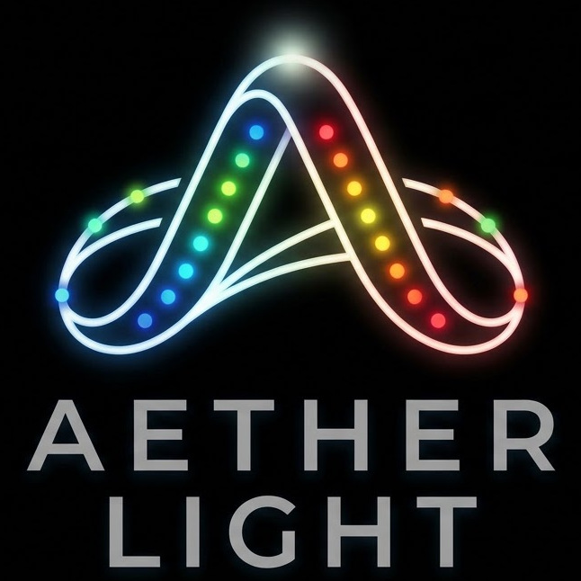

<p align="center">
  
</p>

<h1 align="center">Aether Light</h1>

<p align="center">
  An ESP32-P4 controller for multi-channel addressable LEDs, with a local web interface and DDP/xLights support.
</p>

## Overview

Aether Light turns an [ESP32-P4-Function-EV-Board](https://www.espressif.com/en/products/devkits/esp32-p4-function-ev-board) into a network-controlled LED controller. It drives up to eight addressable LED outputs through the UltraLED component and receives real-time RGB data from DDP-compatible software such as xLights.

Configuration and runtime information are available from a web interface hosted directly on the device. Network, LED, and DDP settings are persisted in NVS and applied after a restart.

## Features

- Up to eight independent LED output channels
- 1–960 pixels per channel
- WS2812/WS2812B, SK6812 RGB, APA106, and SM16703 support
- Configurable data GPIO, pixel count, color order, and brightness per channel
- DDP v1 input on the standard port `4048`
- UDP, TCP, or simultaneous UDP and TCP DDP transport
- Complete-frame mode for xLights and partial-update mode for other DDP senders
- Ethernet-first connectivity with Wi-Fi fallback through the board's ESP32-C6 coprocessor
- DHCP or static IPv4 configuration
- Nearby Wi-Fi network scanning
- Browser-based status, configuration, diagnostics, and reboot controls
- Versioned configuration storage in NVS

## Hardware and software requirements

- ESP32-P4-Function-EV-Board with 16 MB flash
- Compatible 3-wire addressable RGB LEDs
- A power supply sized for the LEDs and expected brightness
- ESP-IDF 6.1 or a compatible ESP-IDF 6.x installation
- USB connection for flashing and serial monitoring
- Ethernet connection for initial access, or Wi-Fi credentials configured at build time

> [!CAUTION]
> Brightness is output scaling, not an electrical current limiter. Size the power supply and wiring for the maximum possible load, connect grounds correctly, and use suitable level shifting and power injection for the LED installation.

## Build and flash

Set up and activate ESP-IDF, then build the primary firmware project:

```sh
cd firmware/aether-light
idf.py set-target esp32p4
idf.py build
```

Flash the board and open the serial monitor, replacing the port with the one used by your board:

```sh
idf.py -p /dev/cu.usbmodemXXXX flash monitor
```

The ESP-IDF Component Manager resolves the board support package, IP101 Ethernet PHY driver, ESP-Hosted Wi-Fi support, and UltraLED dependency from `main/idf_component.yml` and the component manifests.

Optional build-time defaults, including fallback Wi-Fi credentials, Ethernet pins, connection timeout, and HTTP port, can be changed with:

```sh
idf.py menuconfig
```

Look under **Network Manager** and **Web Interface**. Build-time Wi-Fi credentials are used only when no credentials have been saved to NVS.

## First-time setup

1. Connect the board to Ethernet and power it on.
2. Find the DHCP address in the serial monitor or your router's client list.
3. Open `http://<device-ip>/` in a browser.
4. Configure the LED hardware on **LED Channels**. LED output is disabled on a fresh device until a valid configuration has been saved.
5. Configure **DDP / xLights**, then enable DDP.
6. Save the settings. The device restarts to apply configuration changes.

Ethernet is attempted first. If it does not obtain an address within the configured timeout, Aether Light falls back to saved Wi-Fi credentials. The **Network** page can switch between DHCP and a static IPv4 address and can scan for nearby Wi-Fi networks.

## xLights configuration

In xLights, add an Ethernet controller with these settings:

| Setting | Value |
| --- | --- |
| Protocol | DDP |
| Address | The IP address shown by Aether Light |
| Port | `4048` |
| Start channel | The value configured on the **DDP / xLights** page; default is `1` |
| Channel numbering | Enabled |

UDP is the default and recommended xLights transport. Complete-frame mode displays a frame only after all expected RGB data arrives; if a UDP packet is missing, the previous frame remains visible. TCP can be selected when the sender supports ordered, retransmitted delivery.

The web interface reports packet and frame statistics, including incomplete frames, dropped busy frames, duplicate packets, sequence gaps, malformed packets, the last controller address, and rejected competing controllers.

## LED configuration

All active outputs share one LED model, while each channel has its own:

- data GPIO
- pixel count
- color order
- brightness percentage

GPIOs assigned to the Ethernet interface cannot be used for LED data, and a GPIO cannot be assigned to more than one active channel. Invalid stored settings leave LED output inactive while networking and the web interface remain available for recovery.

DDP data is mapped as contiguous RGB bytes across the configured LED channels, starting at the selected xLights start channel.

## Web interface

| Page | Purpose |
| --- | --- |
| **Status** | Shows network, LED, DDP, uptime, CPU, task, reset, and memory state |
| **Network** | Configures DHCP/static IPv4 and Wi-Fi fallback credentials |
| **LED Channels** | Configures the LED model and output channels |
| **DDP / xLights** | Configures DDP transport, channel mapping, frame policy, and timeouts |
| **Configuration** | Summarizes stored settings and firmware limits |
| **Reboot** | Restarts the controller |

## Project structure

```text
.
├── images/
│   └── logo.jpg
└── firmware/
    └── aether-light/
        ├── main/                    Application entry point
        ├── components/
        │   ├── ddp/                 DDP v1 transport and packet handling
        │   ├── ddp_manager/         Frame assembly and LED mapping
        │   ├── network_manager/     Ethernet, Wi-Fi, and IPv4 settings
        │   ├── ultraled_manager/    LED configuration and driver lifecycle
        │   └── web_interface/       Embedded configuration website
        ├── sdkconfig.defaults       Shared project defaults
        └── sdkconfig.esp32p4        ESP32-P4 target settings
```

## Troubleshooting

- **The web interface does not open:** check the serial monitor for the assigned IP address. Verify Ethernet first; Wi-Fi fallback requires saved or build-time credentials.
- **LED output stays disabled:** save a valid configuration on **LED Channels** and allow the device to restart.
- **A channel is rejected:** make sure its GPIO is output-capable, unique, and not reserved by Ethernet.
- **Frames are incomplete:** verify the DDP start channel and output length in xLights. Consider TCP if packet loss is present and the sender supports it.
- **The colors are wrong:** select the correct RGB color order for the strip on **LED Channels**.

To erase saved configuration and return to first-boot behavior, erase flash and reprogram the device:

```sh
idf.py erase-flash
idf.py flash
```
